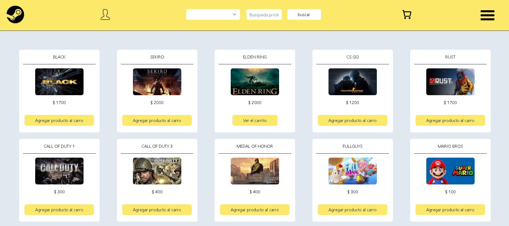

# Game-Store
Game Store es un ecommerce de juegos donde los usuarios pueden crear una cuenta e iniciar sesión, modificar su perfil, restablecer su contraseña, añadir productos al carrito y realizar una compra, ver su historial de compras y el administrador puede hacer lo mismo, pero además administrar todos los productos y las categorías dentro del ecommerce.

Este proyecto fue realizado para mejorar mis habilidades en React y aprender cosas que se utilizan en el ámbito laboral.

## Deployment

1. Copia todos lo que hay dentro de .example.env y crea una carpeta .env para pegarlo dentro

2. Fijarse de cambiar el puerto por el que ustedes quieran en las variables de entorno 

3. Crearse una cuenta de mercado pago para developers y seguir los pasos para encontrar las keys que se usan dentro de la carpeta cart

4. Hacer antes que todo el backend, porque sino va a fallar cuando quieran levantar el proyecto

5. Por ultimo ejecutar npm install y fijarse que ande todo correctamente

## Features

- Busqueda por categorias y por nombre de productos
- Modificacion de perfil (Nombre, imagen, contraseña, desactivar cuenta)
- Registro e inicio de sesion manual (Confirmacion de contraseña via email)
- Reestablecimiento de contraseña via enlace con token
- Administrador de Productos (agregar, editar, eliminar) y Categorias (agregar, editar, eliminar) por ADMIN_ROLE
- Implementación de carrito de compras 
- Compras a traves de Mercado Pago
- Historial de compras

## Tech Stack

**Client:** React, Context, React Router Dom, Axios, TailwindCSS, Flowbite, Mercado Pago, Sweet Alert

## Screenshots

